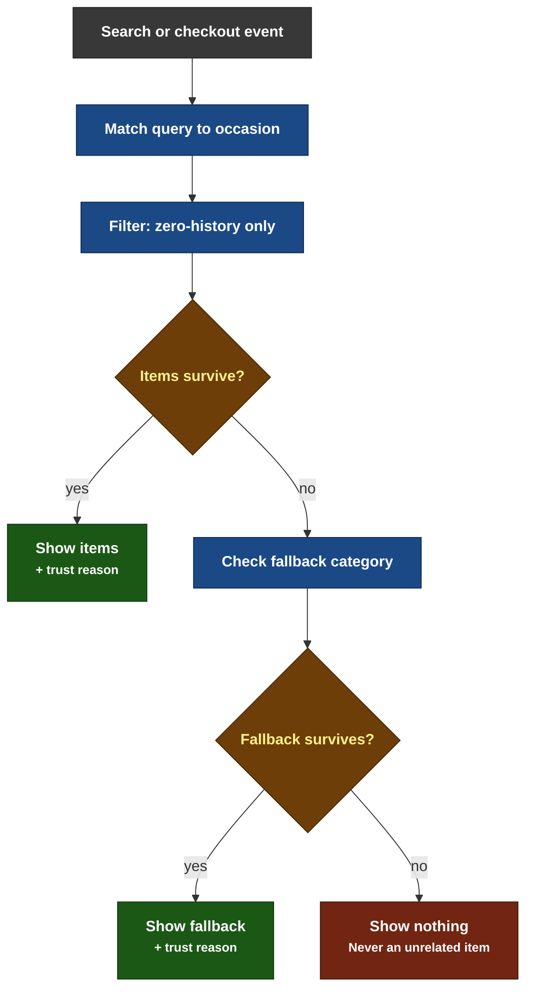

# Scout (formerly Reasoned Discovery Engine / RDE) — MVP Specification

This document is the full functional spec for the RDE prototype. Feed this directly to the coding agent as the source of truth for logic, data structures, and screen behavior. It defines exactly what happens for any search, using three worked examples, plus the underlying algorithm so the logic is deterministic and reproducible — not hardcoded per example.

---

## 1. Category Taxonomy (fixed set used across the whole app)

```
CATEGORIES = [
  "Groceries",
  "Snacks & Beverages",
  "Household Essentials",
  "Pet Supplies",
  "Personal Care & Beauty",
  "Baby Products",
  "Gourmet & Imported Food",
  "Electronics & Accessories"
]
```

## 2. Occasion-Based Suggestion Model (the core "what to suggest" logic)

### How Scout decides what to show

#### The logic behind every suggestion — and why sometimes there isn't one

"The architecture above shows what Scout is built from. This shows what it actually does with it — the exact sequence of checks that runs every time a user searches or reaches checkout, before a single suggestion ever appears on screen."



*Every shown suggestion is split across search and checkout, and marks its category instantly once purchased — the next relevant suggestion only appears in the following week's batch.*

"Every suggestion starts with the same question: does this search or cart imply a shopping occasion Scout recognizes? If it does, candidate items are filtered down to only the categories a user has never bought from — anything they already shop for is excluded automatically.

If nothing survives that filter, Scout doesn't give up immediately — it checks one fallback category before deciding. But if even that comes up empty, Scout shows nothing at all. This is deliberate: an irrelevant suggestion does more damage to trust than no suggestion ever would.

Whatever does get shown is never shown once and forgotten — it's split across two moments, search and checkout, so a user gets a second, lower-pressure chance to consider it. And the moment they buy something new, that category is marked instantly, so it won't be suggested to them again."

---

**This replaces a simpler category-swap idea.** The right mental model is not "one category jumps to one other category" — it's "the search term implies an occasion, and the occasion implies several genuinely relevant, zero-history items across categories." A search for bread isn't just "Groceries" in the abstract, it's a breakfast/pantry moment — so suggestions should fit that moment, not an arbitrary unrelated category.

```json
{
  "bread": {
    "occasion": "Breakfast & Pantry",
    "suggestions": [
      { "item": "Epigamia Greek Yogurt", "category": "Gourmet & Imported Food", "subcategory": "Dairy" },
      { "item": "Real Fruit Juice", "category": "Snacks & Beverages", "subcategory": "Juices" },
      { "item": "Fruit Spread / Jam", "category": "Gourmet & Imported Food", "subcategory": "Spreads" },
      { "item": "Muesli / Granola Pack", "category": "Gourmet & Imported Food", "subcategory": "Breakfast Cereals" },
      { "item": "Herbal / Green Tea Box", "category": "Snacks & Beverages", "subcategory": "Beverages" }
    ]
  },
  "dog food": {
    "occasion": "Pet Care",
    "suggestions": [
      { "item": "Rubber Chew Ball", "category": "Pet Supplies", "subcategory": "Toys" },
      { "item": "Pet Grooming Wipes", "category": "Pet Supplies", "subcategory": "Grooming" },
      { "item": "Pet Bed Cushion", "category": "Pet Supplies", "subcategory": "Bedding" },
      { "item": "Pet Multivitamin Chews", "category": "Pet Supplies", "subcategory": "Health" }
    ]
  },
  "diapers": {
    "occasion": "New Parent Essentials",
    "suggestions": [
      { "item": "Corner & Edge Guards (Baby-Proofing)", "category": "Baby Products", "subcategory": "Safety" },
      { "item": "Soft Rattle Toy Set", "category": "Baby Products", "subcategory": "Toys" },
      { "item": "Baby Sunscreen / Skincare", "category": "Baby Products", "subcategory": "Skincare" },
      { "item": "Compact Baby Monitor", "category": "Electronics & Accessories", "subcategory": "Baby Tech" }
    ]
  },
  "swiss knife": {
    "occasion": "Travel & Camping",
    "suggestions": [
      { "item": "10000mAh Power Bank", "category": "Electronics & Accessories", "subcategory": "Power" },
      { "item": "Braided USB-C Cable", "category": "Electronics & Accessories", "subcategory": "Cables" },
      { "item": "Travel-Size Toiletries Kit", "category": "Personal Care & Beauty", "subcategory": "Travel" },
      { "item": "Energy Bars Pack", "category": "Snacks & Beverages", "subcategory": "Energy Food" },
      { "item": "Insulated Steel Travel Cup", "category": "Household Essentials", "subcategory": "Camping Gear" },
      { "item": "Small Butane Cylinder", "category": "Household Essentials", "subcategory": "Camping Gear" },
      { "item": "Portable Camping Stove", "category": "Household Essentials", "subcategory": "Camping Gear" },
      { "item": "Poncho / Rain Jacket", "category": "Household Essentials", "subcategory": "Weather Gear" }
    ]
  },
  "chips": {
    "occasion": "Snacking & Home Entertainment",
    "suggestions": [
      { "item": "Frozen Popcorn", "category": "Gourmet & Imported Food", "subcategory": "Frozen Snacks" },
      { "item": "Ice Cream Tub", "category": "Gourmet & Imported Food", "subcategory": "Desserts" },
      { "item": "Bluetooth Speaker", "category": "Electronics & Accessories", "subcategory": "Audio" },
      { "item": "Paper Napkins / Plates", "category": "Household Essentials", "subcategory": "Party Supplies" }
    ]
  },
  "shampoo": {
    "occasion": "Self-Care & Relaxation",
    "suggestions": [
      { "item": "Bath Towel", "category": "Household Essentials", "subcategory": "Bath" },
      { "item": "Aromatherapy Candle", "category": "Household Essentials", "subcategory": "Home Fragrance" },
      { "item": "Herbal / Green Tea Box", "category": "Snacks & Beverages", "subcategory": "Beverages" },
      { "item": "Wireless Earbuds", "category": "Electronics & Accessories", "subcategory": "Audio" }
    ]
  },
  "phone charger": {
    "occasion": "Work-From-Home & Desk Setup",
    "suggestions": [
      { "item": "Premium Instant Coffee", "category": "Gourmet & Imported Food", "subcategory": "Coffee" },
      { "item": "Desk Organizer Tray", "category": "Household Essentials", "subcategory": "Organization" },
      { "item": "Travel-Size Toiletries Kit", "category": "Personal Care & Beauty", "subcategory": "Travel" },
      { "item": "Herbal / Green Tea Box", "category": "Snacks & Beverages", "subcategory": "Beverages" }
    ]
  }
}
```

**Note on "swiss knife":** the searched item itself is categorized under `Household Essentials` (multi-tool/utility), while its suggestions span four categories (`Electronics & Accessories`, `Personal Care & Beauty`, `Snacks & Beverages`, `Household Essentials`) — all connected by a real shared occasion (packing for a trip). The Household Essentials items in this pool exist specifically so a persona who's already explored Electronics, Personal Care, and Snacks & Beverages (like Persona B) still gets a genuinely coherent set of suggestions, instead of the pool emptying out and forcing an unrelated fallback item.

**Seasonal context (optional, nice-to-have for the demo, not required for MVP correctness):** if a simple mock "current season" flag is set to monsoon, prioritize Poncho / Rain Jacket higher in the displayed order for this occasion. This is a lightweight way to show the mechanism can incorporate context beyond just purchase history, without adding real complexity — skip this if time-constrained, the pool still works correctly without it.

**Note on "diapers":** the Compact Baby Monitor is a deliberate cross-category link, same principle as the swiss knife example — a new parent's actual shopping list spans Baby Products AND Electronics, connected by the occasion, not the product type.

### 2c. Display Split Across Stages (so search and checkout don't repeat the identical set)

With 4-5 items per occasion now available, don't show the same full set at both search and checkout — split it:

- **At search results:** show the first 2-3 items from the occasion's list (in list order) that are still zero-history for the user.
- **At checkout ("Complete your basket"):** show up to 2 *additional* items from the same occasion's remaining pool — items that were NOT already shown at search, still filtered for zero-history. If the user added something from the search-stage set, that frees it from needing to reappear, and checkout can pull further down the list.
- **If the occasion pool runs out** (rare, only relevant for the smaller 2-item Pet Care list on repeat sessions), fall back to Section 2a's fallback logic to fill any remaining slot.

This way, a user scrolling from search to checkout sees a believably larger, evolving set of relevant options — not one static list echoed twice.

### 2b. Persistence Rule — suggestions must appear at BOTH search AND checkout, not just once

This directly implements the two trigger points defined in Section 4 (search-surface + checkout-completion) — every worked example below must demonstrate both, not just the search-stage insertion.

**Rule:** if a suggested item is shown during search results but the user does NOT add it to cart at that point, the same item (or the remaining un-added items from that occasion match) reappears in the **"Complete your basket"** card at cart review, right before checkout (per Section 4's checkout-completion trigger). This gives a second, lower-pressure exposure moment rather than a one-shot suggestion the user might have simply scrolled past. If the user already added the item during search, it does NOT reappear at checkout (it's already in the cart) — only un-added, still-zero-history items persist forward.

**Coverage across the worked examples:** Examples 1-3 (bread, dog food, diapers) show the case where the user engages and adds the item immediately during search — so the item does not reappear at checkout, since it's already in the cart. Example 4 (swiss knife) shows the opposite case — the user scrolls past at search time, and the persistence rule brings the same suggestions back at checkout. Together, these four examples fully demonstrate both branches of this rule; the agent should implement the underlying logic generally, not as four hardcoded special cases.

**Rendering rule:** at search time, look up the query in this table (fuzzy/partial match on the search term is fine for the prototype — e.g. "baby food" and "diapers" both resolve to the "New Parent Essentials" entry). For each suggested item, check the active persona's profile — only render items whose `category` (or, if you want finer granularity, the specific item itself) the persona has zero purchase history in. Render the surviving items as a distinct labeled row beneath the primary search results: **"Complete your basket."** Each item's outcome (shown or filtered) feeds directly into the right-side live panel (Section 5) — so a single search can surface multiple simultaneous suggestions, which is a more realistic and richer demo of the mechanism than one item at a time.

**Extending this table:** for the prototype, only these four search terms have explicit occasion entries. Any other search should attempt to find a genuinely relevant suggestion via the fallback rule below — but if nothing coherent exists, showing nothing is the correct outcome, not a forced guess. A wrong suggestion is worse than no suggestion.

### 2a. Fallback Rule (finds a relevant suggestion for searches outside the curated four — or shows nothing if none exists)

If the search term does not match an entry in the occasion table above:

1. **Detect the searched item's own top-level category** using a simple keyword match against the 8-category taxonomy (e.g., "milk" → Groceries, "chips" → Snacks & Beverages, "phone charger" → Electronics & Accessories). If no keyword matches, default to "Groceries" — the safest assumption for a quick-commerce app.
2. **Look up that category in this fallback pairing table** — built on the same occasion-coherence principle as the main table above (real-world "shopping mission" adjacency, not arbitrary category variety):

```json
{
  "Groceries": ["Gourmet & Imported Food", "Household Essentials"],
  "Snacks & Beverages": ["Gourmet & Imported Food", "Personal Care & Beauty"],
  "Household Essentials": ["Personal Care & Beauty", "Baby Products"],
  "Pet Supplies": ["Household Essentials", "Gourmet & Imported Food"],
  "Personal Care & Beauty": ["Household Essentials", "Gourmet & Imported Food"],
  "Baby Products": ["Personal Care & Beauty", "Household Essentials"],
  "Gourmet & Imported Food": ["Snacks & Beverages", "Groceries"],
  "Electronics & Accessories": ["Household Essentials", "Groceries"]
}
```

**One honest exception:** Electronics & Accessories genuinely has no strong occasion-based partner — there's no natural real-world "shopping mission" that pairs a charger with groceries or household items the way bread naturally pairs with yogurt. For this category only, don't fabricate a contextual reason. Use a neutral framing instead: "You might also want to explore: [Category]" — without claiming false relevance. This is the one honest gap in the model, and it's better to say so plainly than force a fake connection.

3. **Pick ONE representative item** from each of the two fallback categories listed (a small fixed product per category is enough for the prototype — e.g., a generic "Bestseller in [Category]" placeholder card is acceptable here, since this path won't be manually curated the way the three named examples are).
4. **Filter against the mock user's zero-history categories** exactly as in the main flow — only render items from categories the user hasn't purchased from yet.
5. **If both fallback categories are already in the user's purchase history, do NOT force a suggestion from an unrelated category.** An incoherent suggestion is worse than no suggestion — showing a random item from a category that has no genuine connection to what the user searched damages trust more than simply not showing a "Complete your basket" row at all for that search. In this case, render the search results normally with no RDE row. This should be rare in practice (only 1 of the 3 demo personas ever approaches this edge, and the enriched occasion pools in Section 2 are specifically designed to avoid it for the curated examples) — but when it does happen, silence is the correct behavior, not a forced guess.

**Net result:** every search — whether it's one of the four curated examples or any other query — surfaces either a genuinely relevant set of zero-history suggestions, or nothing at all. It never surfaces something contextually wrong just to fill space.

## 3. Barrier / Reassurance Line Logic

Each category has a pre-classified dominant barrier theme (mirrors real output from the AI Discovery Engine in Part 1 of the project). **Return/refund language must state an honest, category-specific policy — never a blanket "full return, no questions asked" for every category.** Some categories genuinely have short windows, and some are non-returnable; say so plainly rather than promising something uniform. `[X]` marks a placeholder for a real policy value — confirm with actual Blinkit return-window data before shipping the final copy; do not invent a number.

```json
{
  "Pet Supplies": {
    "barrier": "trust_deficit",
    "template": "Zero complaints in past 6 months — 7-day return policy for unopened items."
  },
  "Snacks & Beverages": {
    "barrier": "quality_assurance",
    "template": "Zero complaints in past 3 months — fresh stock & express 8-min delivery."
  },
  "Baby Products": {
    "barrier": "authenticity_concern",
    "template": "Sealed and verified at source — zero complaints in past 6 months."
  },
  "Gourmet & Imported Food": {
    "barrier": "assortment_uncertainty",
    "template": "Zero complaints in past 3 months — small-batch fresh quality guarantee."
  },
  "Household Essentials": {
    "barrier": "quality_assurance",
    "template": "Zero complaints in past 6 months — authentic quality & 3-day return policy."
  },
  "Electronics & Accessories": {
    "barrier": "authenticity_concern",
    "template": "Ships sealed, tamper-proof packaging — zero complaints & 7-day replacement guarantee."
  },
  "Personal Care & Beauty": {
    "barrier": "authenticity_concern",
    "template": "Zero complaints in past 6 months — 100% authentic brand warranty included."
  },
  "Groceries": {
    "barrier": "quality_doubt",
    "template": "Zero complaints in past 6 months — freshness guaranteed with instant replacement."
  }
}
```

## 4. Trigger Points (where RDE fires)

1. **Search-surface** — one suggested item inserted into normal search results, ranked in natural position (not pinned top, not labeled "Ad" or "Sponsored").
2. **Checkout-completion** — one suggested item shown as a single card above the "Proceed to Checkout" button, framed as "You might be missing."

## 5. Right-Side Live RDE Insight Panel (replaces formal event logging — this is a visible UI feature, not a backend system)

**Layout:** phone screen mockup in the center, persona-selector sidebar on the left (Section 7), this panel on the right. The panel is fully reactive to two inputs only:

1. **Which persona is currently selected** (left sidebar)
2. **Which search/category is currently active** on the center phone screen

No other input drives it — no separate "stage" toggle needed; the panel simply reflects whatever the center screen is currently showing.

**What the panel displays, live, as either input changes:**

- **Active persona snapshot:** name + their current habitual categories (pulled directly from Section 7's persona data)
- **Detected occasion:** which entry in Section 2's occasion table matched the current search (e.g., "bread → Breakfast & Pantry")
- **Full reasoning trace — the entire candidate pool for that occasion, each item tagged with its outcome:**
  - ✅ **Shown** — zero-history for this persona
  - ⛔ **Filtered — already habitual** (name the category causing the filter)
- **If the pool is fully filtered out**, the panel visibly shows the fallback logic taking over (Section 2a) — e.g., "Main pool exhausted → falling back to Household Essentials pairings → Baby Products selected." This is the moment worth highlighting live in a demo (Persona B's swiss-knife search).
- **Simple live counters** (plain language, not internal event codes): "Suggestions shown," "Clicked," "Added to cart" — these update in real time as the person interacts with the center screen, giving a lightweight, human-readable version of what Slide 7's metrics table measures, without needing a real backend logging system behind it.

This panel is what makes the mechanism visible and explainable during a live demo — the center screen shows what a real user sees, the right panel shows *why* RDE made that specific decision.

## 6. Home Screen Spec

- Standard search bar at top (primary entry point for any query).
- Below it, a horizontal row of 4 **"Try a demo search"** quick-tap chips: `bread`, `dog food`, `diapers`, `swiss knife` — these exist purely to make the four worked examples below instantly testable without typing, for demo purposes.
- Below that, a normal category grid (all 8 categories) and a "Your usual" row of habitual reorder items (mocked).

### 6a. Screen Content Density (applies to every search results screen)

A screen with only 6-7 total items feels sparse and undermines the demo. Every search results screen must show:

- **5-6 normal, non-RDE organic product cards** for the literally searched item (e.g., 5-6 different bread/bakery products for a "bread" search) — these are ordinary catalog results, unrelated to RDE, and should feel like a real, populated results page on their own.
- **Plus 2-3 RDE-surfaced items** in the "Complete your basket" row (per Section 2c's display-split rule).

This puts every search results screen at a minimum of 7-9 visible items before any scrolling, and the checkout/cart-review screen separately shows its own additional RDE items per Section 2b's persistence rule — so the app feels populated and real throughout the whole flow, not just in the one row that RDE controls.

## 7. Persona Selector (sidebar) & Mock User Profiles

**All three personas must stay inside the established target segment — Daily Essentials Stockers — per Slide 3/4 of the deck.** They differ in lifestyle and which categories they've already dabbled in, not in segment membership. This matters: the point of the selector is to show the SAME mechanism adapting to different purchase histories, not to introduce new, out-of-scope user types.

**Sidebar UI spec:** a persistent, collapsible left sidebar (or top dashboard strip on mobile) with 3 selectable persona cards. Each card shows: a small icon/avatar, the persona name, one-line lifestyle blurb, and — for demo transparency — a visible list of their current "habitual" categories. Selecting a card sets that persona as `active_user` in app state; ALL logic in Sections 2, 2a, and 2c must reference `active_user.purchase_history`, never a hardcoded single profile. Default selection on load: Persona A.

```json
{
  "persona_a": {
    "name": "The Habitual Stocker",
    "lifestyle": "25F, working professional, Mumbai",
    "purchase_history": ["Groceries", "Snacks & Beverages", "Household Essentials"]
  },
  "persona_b": {
    "name": "The Price-Blocked Explorer",
    "lifestyle": "20M, hosteler, Delhi — already dabbles slightly beyond groceries",
    "purchase_history": ["Groceries", "Snacks & Beverages", "Personal Care & Beauty", "Electronics & Accessories"]
  },
  "persona_c": {
    "name": "The Growing Family Shopper",
    "lifestyle": "34F, homemaker, Bengaluru, has a toddler at home",
    "purchase_history": ["Groceries", "Household Essentials", "Baby Products"]
  }
}
```

**Important edge case — already-habitual categories inside an occasion pool:** filtering happens at the category level. If a persona's `purchase_history` already includes a category that appears among an occasion's suggested items, those specific items are filtered OUT of that persona's pool (they're not "new" for that person), even if other personas would see them. Persona C is the clearest example: she already buys Baby Products routinely, so a "diapers" search shows her NO baby-proofing/toy/skincare suggestions (already trusted) — only the Compact Baby Monitor (Electronics & Accessories) remains genuinely new for her.

## 7a. Persona × Search Matrix (what each persona actually sees — computed from Section 2's pools against each persona's history)

| Search | Persona A sees | Persona B sees | Persona C sees |
|---|---|---|---|
| **bread** | Epigamia, Spread, Granola (3 — Juice/Tea filtered, Snacks & Beverages already habitual) | Same as A (3 — Snacks & Beverages also habitual for B) | All 5 items (richest set — neither Gourmet nor Snacks & Beverages are habitual for C) |
| **dog food** | All 4 Pet Supplies items | All 4 Pet Supplies items | All 4 Pet Supplies items (identical across all three — none has touched Pet Supplies) |
| **diapers** | All 4 items (Baby-proofing, Rattle, Skincare, Monitor) | 3 items — Baby items only (Monitor filtered, Electronics already habitual for B) | **Only 1 item — Compact Baby Monitor** (all 3 Baby Products items filtered, already habitual for C) |
| **swiss knife** | 3 items (Power Bank, Cable, Toiletries — Energy Bars filtered since Snacks & Beverages is habitual, and all 4 Household Essentials camping items filtered since Household is also habitual for A) | **4 items (Steel Travel Cup, Butane Cylinder, Camping Stove, Poncho/Rain Jacket)** — the original 4 items filtered out (Electronics, Personal Care, Snacks & Beverages all already his), but the Household Essentials camping items in the pool are zero-history for B, so a fully coherent set survives — **no fallback needed, and no incoherent item ever surfaces** | All 4 original items (Power Bank, Cable, Toiletries, Energy Bars) — the Household Essentials camping items filtered out for her since Household is already habitual for C |

**Why this matters for the demo:** Persona B's swiss knife search is the single most valuable moment in the whole prototype to show live — it's the clearest proof that occasion pools are built deep enough to serve a more experienced, already-exploring user without ever falling back to an incoherent suggestion. Where the original design would have emptied out and forced an unrelated fallback item, the enriched pool (including the Household Essentials camping items) gives Persona B a fully relevant result on its own. Demo this one specifically if you want to prove the system stays coherent even for the hardest case, not just the easy ones.

## 7b. Category Mapping by Persona (authoritative reference — what each persona sees per habitual category they already shop in)

### Persona A — The Habitual Stocker

| They order | Search example | Suggestions shown |
|---|---|---|
| Groceries | "bread" | Epigamia Yogurt, Fruit Spread, Granola Pack *(Gourmet & Imported Food)* |
| Snacks & Beverages | "chips" | Frozen Popcorn, Ice Cream Tub *(Gourmet & Imported Food)*, Bluetooth Speaker *(Electronics)* |
| Household Essentials | "swiss knife" | Power Bank, USB Cable *(Electronics)*, Travel Toiletries Kit *(Personal Care)* |

### Persona B — The Price-Blocked Explorer

| They order | Search example | Suggestions shown |
|---|---|---|
| Groceries | "bread" | Epigamia Yogurt, Fruit Spread, Granola Pack *(Gourmet & Imported Food)* |
| Snacks & Beverages | "chips" | Frozen Popcorn, Ice Cream Tub *(Gourmet)*, Paper Napkins/Plates *(Household Essentials)* |
| Personal Care & Beauty | "shampoo" | Bath Towel, Aromatherapy Candle *(both Household Essentials — only 2 survive, since Snacks & Beverages and Electronics are already his)* |
| Electronics & Accessories | "phone charger" | Premium Instant Coffee *(Gourmet)*, Desk Organizer Tray *(Household — only 2 survive, same reason)* |

### Persona C — The Growing Family Shopper

| They order | Search example | Suggestions shown |
|---|---|---|
| Groceries | "bread" | Epigamia Yogurt, Fruit Juice, Fruit Spread, Granola Pack *(richest set — none of these categories are hers yet)* |
| Household Essentials | "swiss knife" | Power Bank, USB Cable *(Electronics)*, Toiletries Kit *(Personal Care)*, Energy Bars *(Snacks & Beverages)* — all 4 |
| Baby Products | "diapers" | Only Compact Baby Monitor *(Electronics)* — everything else in this pool is Baby Products, which is already hers |

**This table is the ground truth for how the agent should implement the filtering logic** — if the agent's build produces a different result than what's listed here for any persona/search pair, the implementation has a bug, not the spec.

---

**Note: Worked Examples 1-4 below all assume Persona A (default selection on load) is active**, and describe the richest/most illustrative path for each search. For what Personas B and C see for the same four searches, refer to the matrix in Section 7a — most notably Persona C's very different diapers result (1 item, not 4) and Persona B's swiss knife result (fallback logic fires, not the main pool).

## 8. WORKED EXAMPLE 1 — Search: "bread"

**Occasion detected:** Breakfast & Pantry (Section 2 lookup)
**Suggestions surfaced (all zero-history for the mock user):** Epigamia Greek Yogurt (Gourmet & Imported Food), Real Fruit Juice (Snacks & Beverages), Fruit Spread (Gourmet & Imported Food)

**Screen-by-screen:**
1. **Search Results:** normal bread/bakery items shown (5-6 cards, per Section 6a), followed by a distinct row labeled "Complete your basket" containing all three suggested items as smaller cards. `EXPOSURE` fires once per item rendered (3 events).
2. **Tap any one item → Product Detail:** shows that item's own reassurance box, using its category's template from Section 3 (e.g., Epigamia → Gourmet & Imported Food template). `ENGAGEMENT` fires for that item.
3. **Add to Cart:** toast — "Added to cart. First [category name] item — nice, you're exploring something new!" `CONVERSION` + `NSM_HIT` fire for that item's category.
4. **Cart/Checkout:** item appears in cart list normally.
5. **Order Confirmation:** pill badge shows the specific category just unlocked (e.g., "New category tried this month: Gourmet & Imported Food"). If the user added more than one suggested item across different categories in the same session, show one badge per distinct new category.

---

## 9. WORKED EXAMPLE 2 — Search: "dog food"

**Occasion detected:** Pet Care
**Two things happen simultaneously, since Pet Supplies itself may be zero-history for this user AND the occasion table has its own suggestions:**
1. If Pet Supplies is zero-history for the user, the primary dog food results carry a category-level reassurance banner (per Section 3's Pet Supplies template) — since every item on this page is already a first-time purchase for them.
2. The "Complete your basket" row (per Section 2) surfaces the occasion-linked items: Rubber Chew Ball and Pet Grooming Wipes — both zero-history subcategories (Toys, Grooming) within Pet Supplies.

**Screen-by-screen:**
1. **Search Results:** normal dog food product cards (5-6 cards, per Section 6a) + top banner reassurance (if applicable) + "Complete your basket" row with the ball and grooming wipes. `EXPOSURE` fires for the banner once, plus once per basket item.
2. **Tap any item → Product Detail:** reassurance box shown, using the Pet Supplies template. `ENGAGEMENT` fires.
3. **Add to Cart → Checkout → Confirmation:** same flow as Example 1, `CONVERSION` + `NSM_HIT` fire per item added, badge(s) show accordingly.

**Why this matters for the demo:** this example shows RDE handling three things at once — a user directly searching a new category, PLUS occasion-relevant items within that same new territory, all reassured honestly and all counted correctly toward the NSM.

---

## 10. WORKED EXAMPLE 3 — Search: "diapers" (or "baby food")

**Occasion detected:** New Parent Essentials
**Suggestions surfaced:** Corner & Edge Guards (Baby Products, Safety), Soft Rattle Toy Set (Baby Products, Toys) — both zero-history subcategories alongside the diapers themselves.

**Screen-by-screen:**
1. **Search Results:** normal diaper product cards (5-6 cards, per Section 6a) + category-level reassurance banner (Baby Products template, since this is likely a first-time category entry) + "Complete your basket" row with baby-proofing and toys. `EXPOSURE` fires accordingly.
2. **Product Detail:** reassurance box repeats the relevant template per item tapped. `ENGAGEMENT` fires.
3. **Add to Cart:** toast per item — "Added to cart. First Baby Products item — nice, you're exploring something new!" `CONVERSION` + `NSM_HIT` fire.
4. **Order Confirmation:** badge — "New category tried this month: Baby Products."

---

## 11. WORKED EXAMPLE 4 — Search: "swiss knife" (demonstrates the persistence rule end to end)

**Occasion detected:** Travel & Camping
**Suggestions surfaced:** 10000mAh Power Bank and Braided USB-C Cable — both `Electronics & Accessories`, both zero-history for the mock user, connected by occasion (packing for a trip) rather than category similarity.

**Screen-by-screen:**
1. **Search Results:** normal swiss knife / multi-tool product cards (5-6 cards, Household Essentials, per Section 6a) + "Complete your basket" row showing the power bank and cable. `EXPOSURE` fires for both items.
2. **User does NOT tap or add either item** — scrolls past, adds only the knife itself to cart. No `ENGAGEMENT` or `CONVERSION` fires for the two suggestions at this stage.
3. **Cart Review (checkout-completion trigger fires — Section 2b in action):** because neither suggested item was added during search, BOTH reappear in the "Complete your basket" card above the "Proceed to Checkout" button. This is the second exposure moment. `EXPOSURE` fires again for both items (a fresh impression, since this is a distinct screen/moment).
4. **User taps the power bank → Product Detail:** reassurance box shown, using the Electronics & Accessories template from Section 3. `ENGAGEMENT` fires.
5. **Add to Cart:** toast — "Added to cart. First Electronics & Accessories item — nice, you're exploring something new!" `CONVERSION` + `NSM_HIT` fire.
6. **Order Confirmation:** badge — "New category tried this month: Electronics & Accessories."

**This example is the one to demo first if you only have time to show one flow** — it's the clearest proof that (a) occasion-matching works across genuinely unrelated product types, and (b) the two-trigger design (search + checkout) actually functions as designed, not just in theory.

---

## 12. Build Notes for the Agent

- Keep `purchase_history` mutable in app state (not persisted to a real DB) — when a `CONVERSION` fires, add that category to `purchase_history` immediately, so the adjacency/fallback logic in Section 10 works correctly within a single demo session.
- All reassurance lines come ONLY from the fixed template table in Section 3 — never generate freeform text for this, since the whole point being demonstrated is that lines are grounded in pre-classified data, not invented live.
- The right-side live insight panel (Section 5) is the single most important element for making this feel like a real MVP rather than a static mockup — prioritize building it early, even in rough form, before polishing visuals.